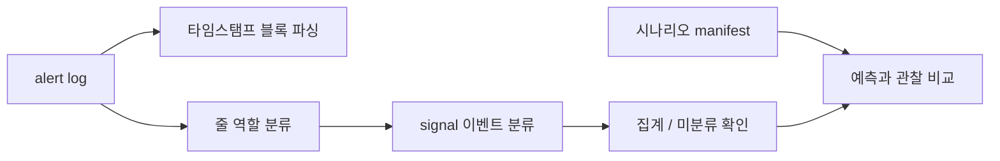

# Oracle Alert Log Analysis

**Experimental** · Oracle 운영 로그 분석 / Python / 규칙 기반 분류

Oracle alert log를 파싱하고 줄의 역할과 이벤트 유형을 구분하는 분석 프로젝트입니다.
로그에 남은 근거로 설명할 수 있는 범위와 추가 자료가 필요한 범위를 구분합니다.

## 문제와 내가 한 일

ORA 코드가 있다고 항상 장애인 것은 아니고 코드가 없어도 중요한 상태 변화가 발생합니다.
단순 키워드 검색으로 정상 종료와 장애를 혼동하지 않도록 파서·이벤트 사전·분류기를 구현했습니다.

스터디 과정에서 구현한 [타임스탬프 블록 파서](parse.py), [분류기](classify.py), [이벤트 사전](event_dict.yaml)과
[수집 시나리오·관찰 기록](corpus/manifest.yaml)을 공개합니다. 담당 구현은 해당 파일의 커밋 이력에서 확인할 수 있습니다.

## 현재 기능과 기술 판단

- `parse.py`: 타임스탬프 단위 블록, ORA 코드, 대표 메시지와 원문을 추출합니다.
- `classify.py`: 먼저 줄 역할을 분류한 뒤 signal에 이벤트 사전을 적용합니다. 규칙 순서는 우선순위입니다.
- ORA 코드는 줄 머리에서 찾아 5자리로 정규화합니다. 본문 설명에 등장한 코드의 오탐을 줄이기 위한 선택입니다.
- `--unknown`은 미분류 줄, `--events`는 이벤트별 집계를 보여줍니다.
- **Python / 정규식 / YAML**: 분류 근거를 원문·규칙에 대조하고 사전을 수정할 수 있게 했습니다. 학습 모델의 정확도를 주장하는 프로젝트가 아닙니다.

## Architecture · 파싱과 라벨 구조



블록 파서와 줄 분류기는 **별도의 진입점**입니다. 현재 분류기가 블록 파서 출력을 입력받는 구조는 아닙니다.

[코퍼스](alert_corpus_20260806.log)에는 시나리오 마커가 있고,
[manifest](corpus/manifest.yaml)는 실행 전 `expect`와 실행 후 `verify`를 구분합니다.
마커 밖의 줄과 미분류 신호도 보존합니다. [수집 방법](corpus/README.md) · [판단 근거](DESIGN.md)

## 실행

Python 3와 PyYAML이 필요합니다. 저장소 루트에서 실행합니다.

```bash
python3 -m venv .venv
source .venv/bin/activate
python -m pip install PyYAML
python parse.py alert_corpus_20260806.log
python classify.py alert_corpus_20260806.log
python classify.py alert_corpus_20260806.log --unknown
python classify.py alert_corpus_20260806.log --events
```

공개 코퍼스를 읽는 명령입니다. Oracle에 접속하거나 DB 상태를 바꾸지 않습니다.

## 테스트·검증과 한계

- 코퍼스의 시나리오·관찰 기록과 분류 결과를 비교하는 방식으로 검증합니다.
- 현재 별도 자동 테스트 스위트와 GitHub Actions CI는 없습니다. CLI 집계 결과를 단위 테스트 통과나 일반화된 정확도로 표시하지 않습니다.
- 분류 커버리지는 **규칙에 매칭된 범위**이며 이벤트 판정의 정확도와 같지 않습니다.
- 확인 가능한 것: 실제 로그에 기록된 기동·종료·복구·오류와 일부 상태 변화.
- 확인할 수 없는 것: alert log에 남지 않은 백업 성공/실패, 파싱 단계에서 거부되어 기록되지 않은 명령, 로그 밖의 원인.
- DB·웹 서버·실시간 감시·자동 복구는 현재 구현 범위가 아닙니다.

## 현재 상태

**Experimental** — 수집 코퍼스에 대한 파싱·규칙 분류까지 구현했습니다.
이 프로젝트는 Oracle 운영 로그를 분석하는 학습·개발 사례이며 상용 DBA 운영 경력을 의미하지 않습니다.

[스터디 기록](study_log) · [설계 노트](DESIGN.md) · [포트폴리오](https://gwangwon.dev)
